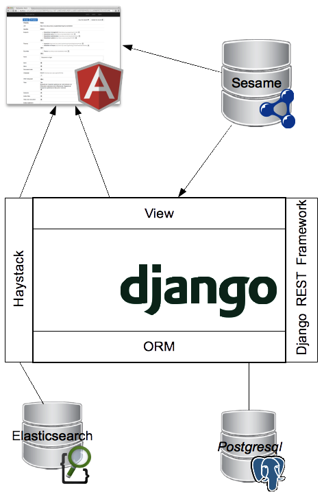

************
Architecture 
************

L'application Back-Office Plan4Learning utilise les technologies suivantes: 

*Django* - https://www.djangoproject.com/
    C'est un framework web basé sur Python. De nombreux modules sont disponibles pour étendre ses fonctionnalités. 
    En particulier, nous utilisons les modules suivants : 

    * *South* - http://south.aeracode.org/. Ce module permet de gérer les migration de bases de données (schéma + données).
      On peut alors facilement appliquer les changements du modèle de donnée sur un système en production.   
    * *Django REST Framework* - http://django-rest-framework.org/ : Permet de facilement de facilement mettre en œuvre une API de type REST.
    * *haystack* - http://haystacksearch.org/ : Facilite l'utilisation dans Django des moteurs d'indexation full-text comme Lucene ou elasticsearch

*Postgresql* - http://www.postgresql.org/
    Base de donnée relationnelle. Nous l'utilisons en fait par l'intermédiaire de la couche ORM de Django

*Sesame* - http://www.openrdf.org/
    C'est en fait un framework de gestion RDF. Nous l'utilisons ici comme triple store RDF et endpoint SPARQL

*Elasticsearch* - http://www.elasticsearch.org/
    Moteur d'indexation full-text basé sur Lucene. Nous l'utilisons par l'intermédiaire du module Django Haystack.   

*Angularjs* - http://angularjs.org/
    Framework javascript. Nous l'utilisons en particulier dans la page d'édition des notices afin de gérer les interactions complexes entre la notice et ses sous-objets.
    
*Bootstrap* - http://getbootstrap.com/
    Framework CSS. Il a été utilisé sur toutes les pages de l'application.
    
    
