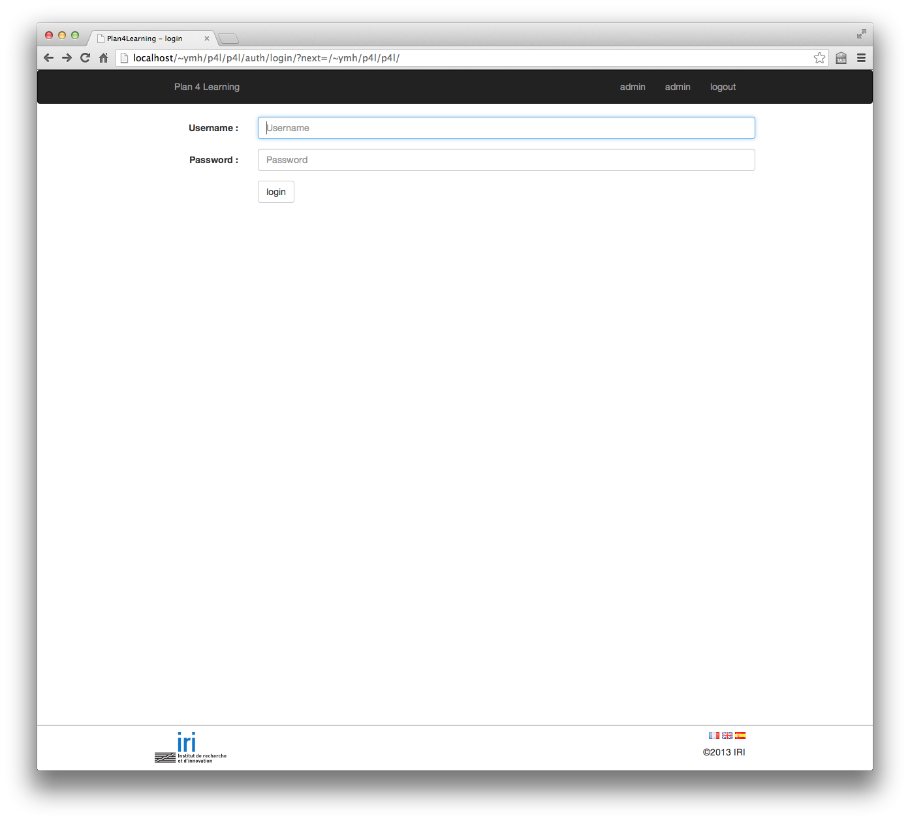
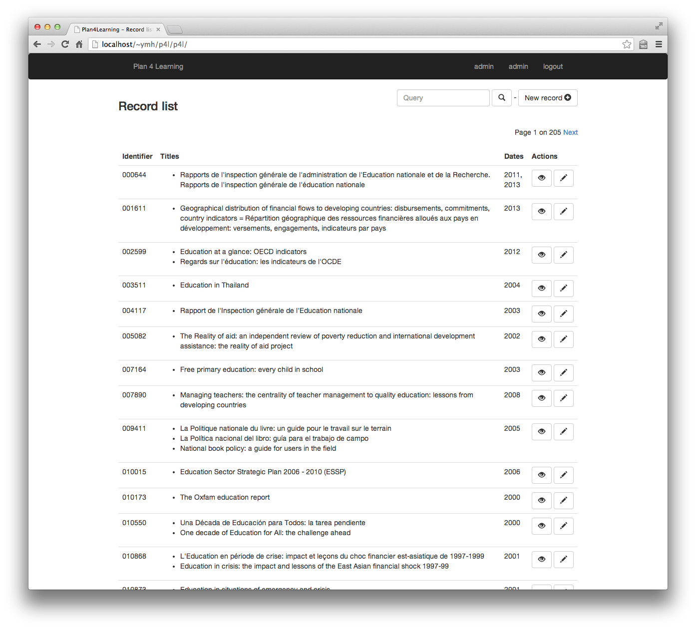
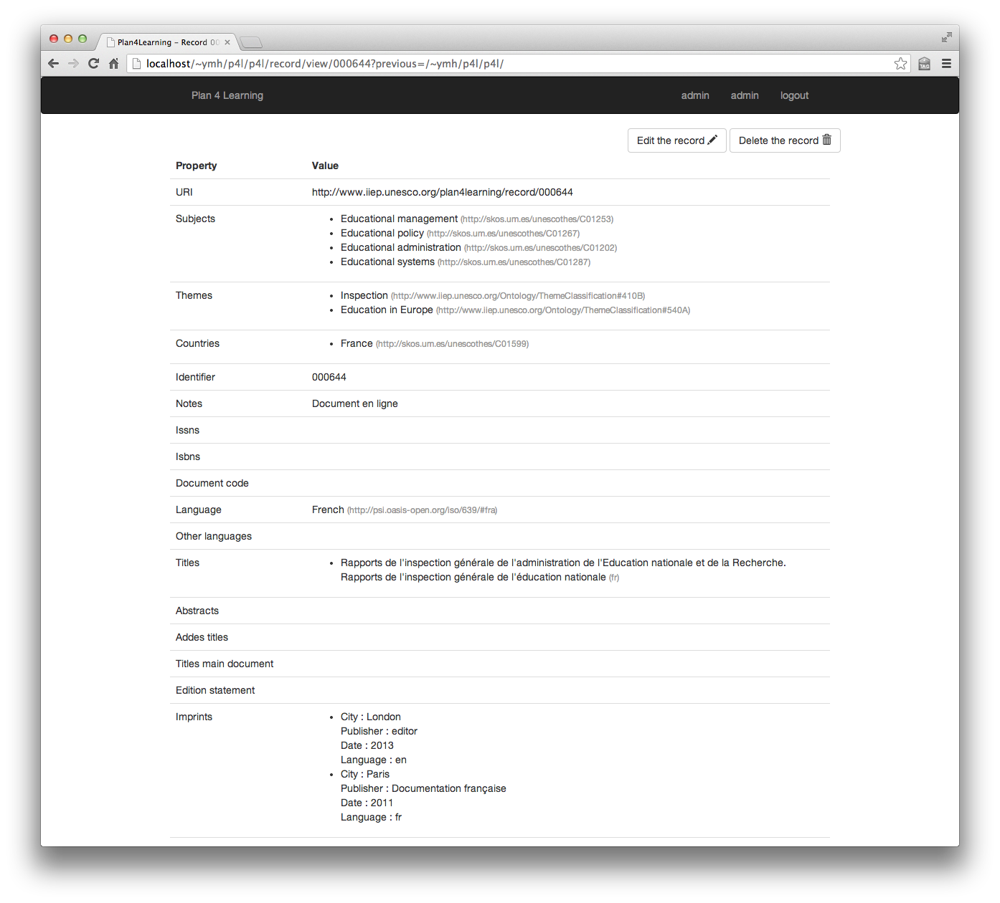
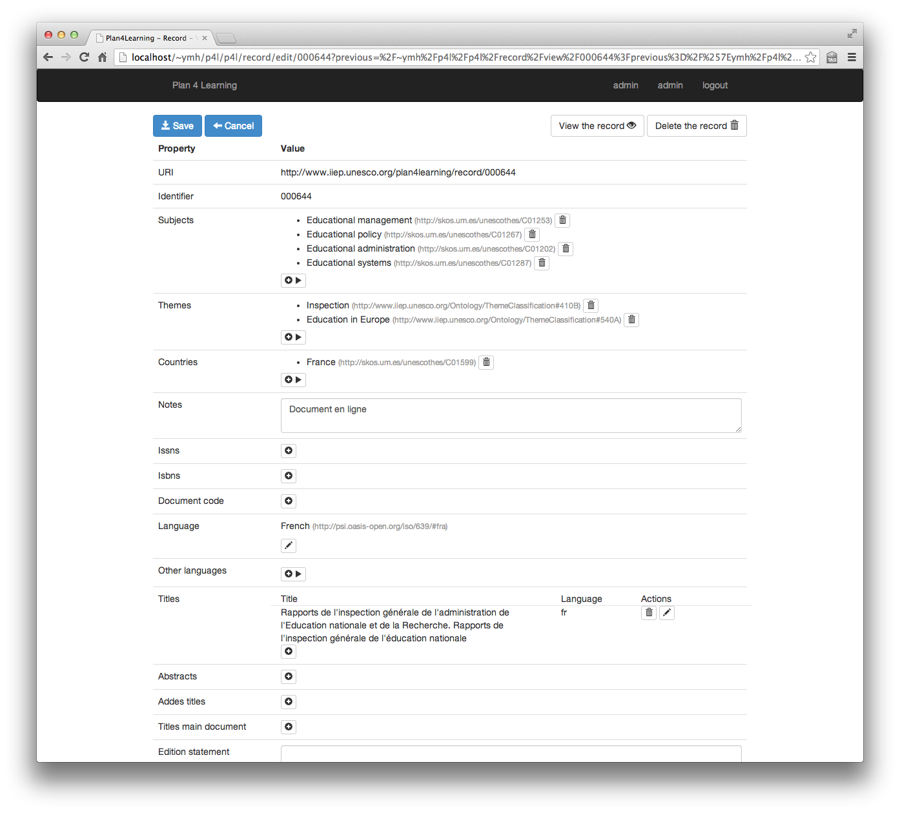

**************************
Description de l'interface
**************************

L'application est constituée de 4 écrans.
Ces écrans sont des pages html5.
Ces pages utilisent le framework css Bootstrap (http://getbootstrap.com/).

Connection
==========

Toutes les pages de l'application sont protégées par un système de login/mot de passe.
Ce dialogue de connection s'affiche lorsque l'utilisateur essaye d'accéder à une des pages de l'application et qu'il n'est pas connecté.

Liste des notices
=================

Cet écram donne la liste des notices et permet la recherche.
La recherche se fait sur l'identifiant d'une notice, le(s) titre(s) d'une notice et les autheurs (personnes ou institutions).

Les notices sont toujours affichés dans l'ordre de leur identifiant (tri lexicographique ascendant).

En haut de la liste un bouton permet l'ouverture du dialogue de création d'une nouvelle notice.
Pour chaque notice de la liste 2 boutons sont proposés : vue de du détail de la liste ou bien édition. 

En haut de la page se trouve un champ de recherche permettant le filtrage des notices.
C'est une recherche de type full-text qui porte sur les champs suivants des notices :
  
    * identifiant
    * titres (dans toutes les langues)
    * années de publication
    * autheurs (personnes et entités)

Le champ de recherche permet l'utilisation d'un mini language de requête décrit à l'adresse suivante : http://pythonhosted.org/Whoosh/querylang.html
Les points à noter à ce ce sujet sont :
  
    * L'opérateur par défaut est le ``OR``.
    * la valeur du spécifieur ``field`` doit être dans la liste suivante : ``identifier``, ``titles``, ``years``, ``authors``.

.. _interface-detail:

Visionnage d'une notice
=======================

Cet écran donne accès à l'affichage du deetail d'une notice. Deux boutons permettent soit de passer à l'écran d'édition de la notice, soit de pouvoir l'éfacer.
Un dialogue de confirmation de l'effacement sera affiché préalablement à l'utilisateur.
Par contre, tout effacement d'une notice est définitif.

.. _interface-edit:

Édition d'une notice
====================

Cet écran permet l'édition d'une notice (nouvelle ou bien existante).
Un bouton d'annulation permet d'interrompre l'édition d'une fiche à tout moment.
Les modifications d'une fiche (ou bien sa création) ne seront sauvegardées seulement après avoir appuyer sur le boouton de sauvegarde.

Toute navigation hors de cet écran que ce soit en cliquant sur l'un des lien ou un des boutons de l'interface ou que ce soit en utilisant les fonctionalité du navigateur annulera sans prévenir l'édition en cours.
Tout les changements non sauvegardés seront perdus.

Tous les champs sont éditables, a part les champs "identifiant" et "URI" qui sont en lecture seule.

Deux boutons sont disponibles pour accéder au deetail de la notice ou bien à son effacement. Dans ce dernier cas un dialogue de confirmation sera affiché anant l'effacement définitif de la notice.

  